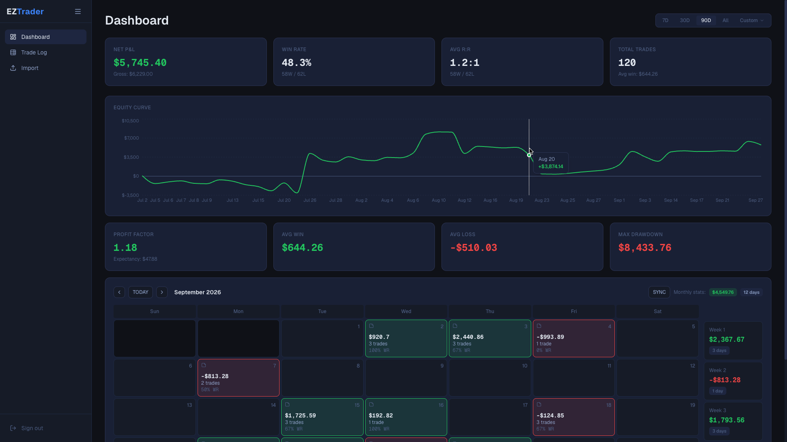
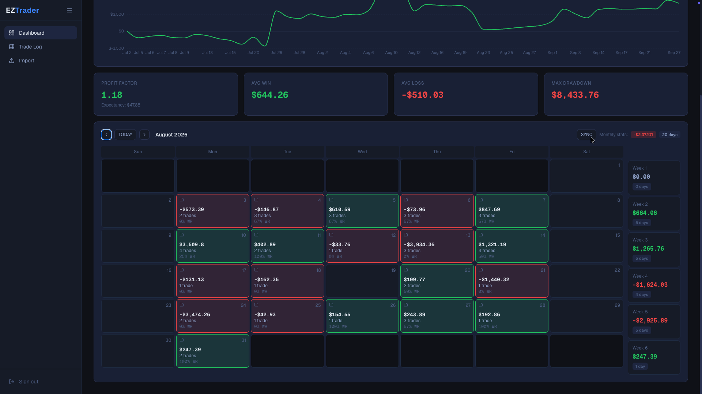
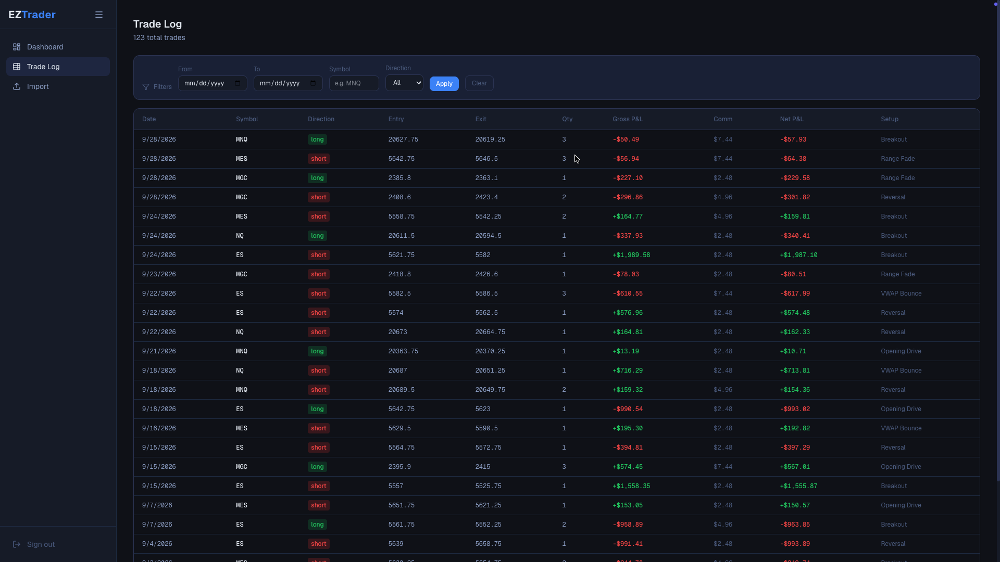

# EZTrader

A futures trading journal that shows how you actually performed over any trading period. Import your trades from NinjaTrader or Tradovate, pick a date range, and get your core stats, equity curve, and a P&L calendar in one view.

**Live demo:** [eztrader.vercel.app/dashboard]([https://your-app.vercel.ap](https://eztrader-tau.vercel.app/dashboard)p)

---

## Screenshots

### Dashboard


### Calendar Widget


### Trade Log



---

## Features

- **Stats by trading period.** Switch between 7D, 30D, 90D, all time, or a custom date range. Clicking a month on the calendar focuses every stat on that month.
- **Core performance metrics.** Net P&L, win rate, average reward-to-risk, profit factor, average win and loss, expectancy, and max drawdown.
- **Equity curve.** Cumulative P&L over the selected range.
- **Monthly P&L calendar.** See your green and red days at a glance.
- **Trade log.** Filter by date, symbol, and direction.
- **CSV import.** Upload execution reports from **NinjaTrader** or **Tradovate**. The broker is detected from the file's headers, and Tradovate fills are paired into round-trip trades automatically.
- **Accounts and auth.** Supabase handles email sign-in, and each user only sees their own data.
- **Demo mode.** Runs on built-in sample data with no database, so anyone can try it instantly.

## Tech Stack

| Layer | Tools |
| --- | --- |
| Frontend | Next.js 16 (App Router), React 19, TypeScript, Tailwind CSS 4 |
| Charts | Recharts |
| Auth and database | Supabase (Postgres) |
| Analytics service | Python, FastAPI, Pydantic |
| Hosting | Vercel |

## Architecture

```
Browser ──> Next.js (Vercel)
               ├── Supabase ............ auth, accounts, trades
               └── /api/analytics ──> FastAPI service (python-api/)
                        │
                        └── falls back to a TypeScript implementation
                            if the Python service is unavailable
```

The dashboard sends the trades in the selected range to `/api/analytics`, which forwards them to the FastAPI `/analytics/summary` endpoint. If that service can't be reached, the same stats are computed in TypeScript, so the app works with or without the Python backend.

## Getting Started

### Prerequisites
- Node.js 20+
- Python 3.11+ (optional, for the analytics service)
- A Supabase project (optional, since demo mode runs without one)

### 1. Clone and install
```bash
git clone https://github.com/zpoettker/eztrader.git
cd eztrader
npm install
```

### 2. Configure environment variables
Create a `.env.local` file in the project root:

```bash
NEXT_PUBLIC_SUPABASE_URL=https://your-project.supabase.co
NEXT_PUBLIC_SUPABASE_ANON_KEY=your-anon-key

# Optional
PYTHON_API_URL=http://localhost:8000
NEXT_PUBLIC_DEMO_MODE=false
```

If `NEXT_PUBLIC_SUPABASE_URL` isn't set, the app starts in demo mode automatically.

### 3. Run the app
```bash
npm run dev
```
Open [http://localhost:3000](http://localhost:3000).

### 4. (Optional) Run the analytics service
```bash
cd python-api
pip install -r requirements.txt
uvicorn main:app --reload --port 8000
```

## Deployment

- **Frontend:** Import the repo into Vercel and add the environment variables above. Pushes to `main` redeploy automatically.
- **Supabase:** Set the Site URL under Authentication → URL Configuration to your Vercel domain so confirmation emails link to the right place.
- **Analytics service (optional):** Deploy `python-api/` to Render or Railway with the start command `uvicorn main:app --host 0.0.0.0 --port $PORT`, then set `PYTHON_API_URL` in Vercel.

## Roadmap

- [ ] Stats by trading session (Asia / London / New York)
- [ ] Setup tag analytics
- [ ] Trade screenshots and notes
- [ ] More broker imports

## Author

**Zachary Poettker**. [GitHub](https://github.com/zpoettker)
